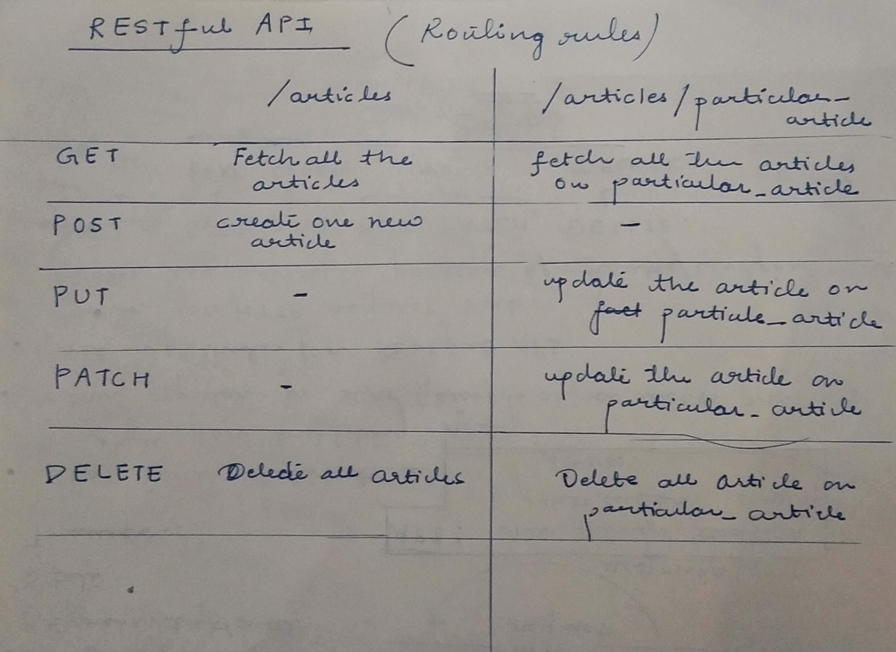

# RESTful-API
REST stands for REpresentational State Transfer
REST is nothing but an architectural style for building APIs. 
Set of rules for RESTful API are: 
      - use HTTP request verb.
      - use specific patter of routes/endpoint URL.

